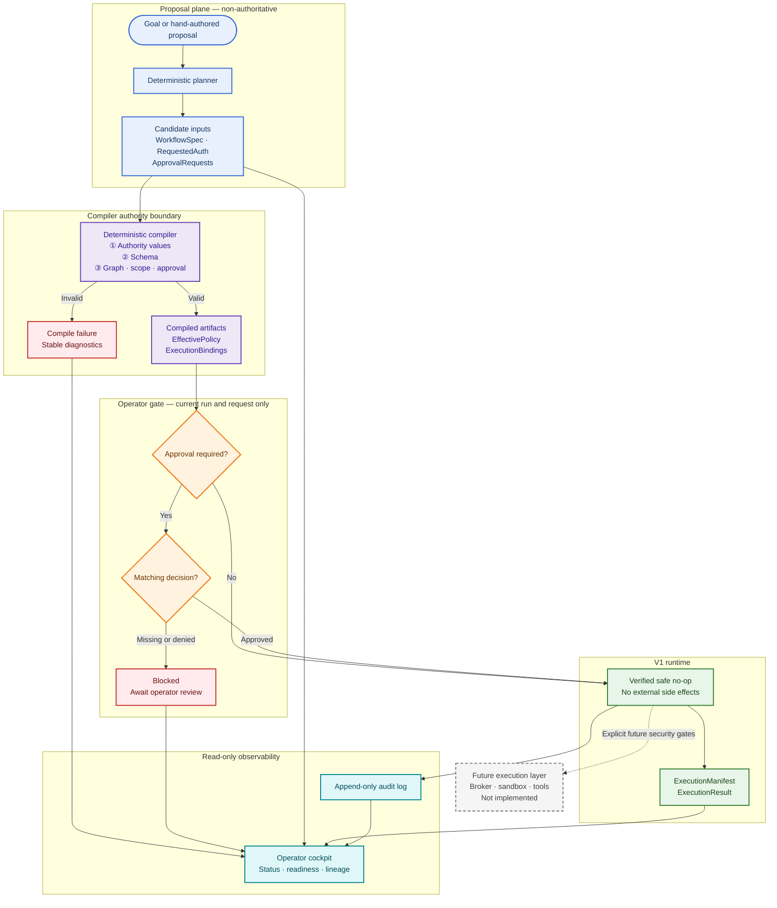

# Workflow Harness

> A deterministic, policy-governed control plane for proposing, compiling,
> approving, inspecting, and auditing dynamic workflows.


Workflow Harness demonstrates how an agentic workflow can be governed before
real execution is introduced. A planner may propose work, but only the
deterministic compiler can produce authority-bearing artifacts. Operator
approval is explicit and scoped to the current run and request, while the
runtime, verifier-facing projections, and audit trail remain inspectable.

> [!IMPORTANT]
> **V1 is intentionally safe no-op only.** It performs no real tool execution,
> connector calls, MCP calls, network calls, broker calls, sandbox execution, or
> external side effects. Future-facing broker, sandbox, capability, and evidence
> documents are designs and inspection surfaces—not enabled capabilities.

## Why this project exists

Dynamic workflow systems need a clear boundary between *suggesting* an action
and *authorizing* it. This repository makes that boundary concrete with
deterministic artifacts and fail-closed validation:

```text
Planner suggests.
Compiler authorizes.
Operator approves.
Runtime executes only what was compiler-authorized and operator-approved.
Verifier reports.
Audit preserves lineage.
```

The current implementation is a control-plane proof: it exercises the entire
governance path without granting a model, planner, or runtime ambient authority.

## What is implemented

| Area | Current capability |
| --- | --- |
| Planning | Deterministic candidate generation and display-only workflow strategy previews |
| Compilation | Canonical JSON, revision IDs, dependency digests, phased static validation, and compiled artifacts |
| Authority | Compiler-owned policy and execution-binding artifacts; unsupported authority claims fail closed |
| Approval | Exact, current-run/request approval decisions with no carryover or authority subsumption |
| Runtime | Artifact loading, start verification, execution manifests, and deterministic safe no-op results |
| Operations | Read-only run inspection, rich operator summaries, review notes, approval decisions, and readiness projections |
| Audit | Append-only audit logs and deterministic event helpers |
| Quality | Valid/invalid fixtures, JSON schemas, contract documentation, and a comprehensive unit-test suite |

## Quick start

### Prerequisites

- Python 3.12 or newer
- Git

The project currently declares no third-party runtime dependencies. Commands can
be run directly from the repository root.

```bash
git clone https://github.com/akashm776/workflow-harness.git
cd workflow-harness
python --version
```

### 1. Preview a workflow strategy

This is deterministic, display-only, and writes no files:

```bash
python -m cli.workflow_strategy_preview_cli \
  --goal "Find innovation opportunities from program docs and repo context"
```

### 2. Run the end-to-end safe no-op demo

```bash
python -m cli.workflow_demo_cli \
  --goal "Generate innovation ideas from program data" \
  --node-type-registry fixtures/valid/simple-workflow/input/NodeTypeRegistry.json \
  --repo-root . \
  --run-dir runs/workflow-demo
```

The demo writes a self-contained bundle under `runs/workflow-demo`. Depending on
the selected workflow and approval state, the expected result is either a
completed safe no-op or a run blocked for operator review—never real execution.

### 3. Inspect the operator summary

```bash
python -m cli.run_status_cli \
  --run-dir runs/workflow-demo \
  --summary
```

For a guided blocked-to-approved walkthrough, including review notes and a
current-request approval decision, see the
[Safe No-Op Demo Script](docs/SAFE_NOOP_DEMO_SCRIPT.md).

## How the control plane works



The color transition is the important part: blue proposal artifacts carry no
authority; purple compiler outputs cross the authority boundary; amber approval
binds only to the current request; and green runtime behavior remains a verified
no-op. The dashed gray execution layer is deliberately outside V1.

Validation is ordered and gated. Later interpretation phases do not run when an
earlier authority-value or schema phase fails, which keeps diagnostics
deterministic and prevents malformed input from gaining meaning accidentally.

## Artifact model

### Control-plane inputs

| Artifact | Owner / purpose |
| --- | --- |
| `WorkflowSpec.json` | Candidate workflow graph and node metadata |
| `NodeTypeRegistry.json` | Allowed node types and structural constraints |
| `RequestedAuth.json` | Proposed tool, connector, and scope requests |
| `ApprovalRequests.json` | Requests requiring an operator decision |
| `ApprovalDecisions.json` | Optional operator-owned decisions for the current request |

### Compiler and runtime outputs

| Artifact | Produced when |
| --- | --- |
| `CompilationReport.json` | Every compile attempt |
| `CompiledArtifactIndex.json` | Every compile attempt |
| `EffectivePolicy.json` | Successful compilation |
| `ExecutionBindings.json` | Successful compilation |
| `AuditLog.jsonl` | Safe-run orchestration |
| `ExecutionManifest.json` | Compilation succeeds and a run can be represented |
| `ExecutionResult.json` | An execution manifest exists; result remains safe no-op |

See [Authority Artifact Ownership](docs/AUTHORITY_ARTIFACT_OWNERSHIP.md) for the
full ownership and trust-boundary contract.

## Command guide

| Command | Purpose | Writes files? |
| --- | --- | --- |
| `python -m cli.workflow_strategy_preview_cli` | Preview a likely governed workflow strategy | No |
| `python -m cli.planner_check_cli` | Build a candidate and compile-check it | Candidate files, unless `--dry-run` |
| `python -m cli.workflow_demo_cli` | Run goal → candidate → compile → safe no-op | Yes, under `--run-dir` |
| `python -m cli.safe_run_cli` | Compile and run hand-authored artifacts | Yes, unless `--dry-run` or `--check` |
| `python -m cli.run_status_cli` | Inspect a persisted run (`--text`, `--view`, or `--summary`) | No |
| `python -m cli.operator_review_notes_cli` | Add display-only, node-scoped operator notes | Yes, in the selected run |
| `python -m cli.operator_approval_decisions_cli` | Record a current-run/request approval decision | Yes, in the selected run |

Every command exposes its complete interface through `--help`.

## Operator cockpit

The opt-in `run_status_cli --summary` view can render display-only sections for:

- review gates and candidate workflow structure;
- compiler governance timeline and authorization projections;
- proposed tool access and fixture lineage;
- operator review notes and approval binding;
- broker handoff and approved-capability readiness previews;
- verifier/evidence and broker-boundary status;
- lifecycle stage, readiness checklist, and operator review packet.

These surfaces summarize known local artifacts. They do not approve, authorize,
execute, validate, or create reusable authority.

## Repository layout

```text
workflow-harness/
├── audit/          # Audit event builders and append-only log writer
├── broker/         # Future broker contract shapes; no broker implementation
├── cli/            # Planner, compiler, runtime, approval, and status commands
├── compiler/       # Validation, compilation, hashing, policy, and bindings
├── docs/           # Current contracts, security boundaries, and future designs
├── examples/       # Guided safe no-op demonstrations
├── fixtures/       # Valid, invalid, and explicitly future-only examples
├── orchestrator/   # Compile/verify composition and safe no-op orchestration
├── planner/        # Deterministic, non-authoritative candidate planning
├── registry/       # Lifecycle, ownership, and side-effect registries
├── runtime/        # Bundle loading, start verification, status, and results
├── schemas/        # JSON schemas for control-plane and emitted artifacts
├── tests/          # Unit and contract tests
└── tui/            # Dependency-free operator status renderers
```

The original design inputs remain available at
[A2A-DYNAMIC-WORKFLOW-SPEC.md](A2A-DYNAMIC-WORKFLOW-SPEC.md),
[architecture-authority-flow.puml](architecture-authority-flow.puml), and
[architecture-artifact-audit.puml](architecture-artifact-audit.puml).

## Safety boundaries

V1 deliberately does **not** provide:

- real tools, connectors, MCP integrations, or network access;
- a broker, sandbox, or execution backend;
- LLM-driven planning or model calls;
- approval carryover, reusable approvals, or authority subsumption;
- ambient runtime authority;
- side-effect catalog enforcement;
- production verifier or evidence generation.

Future-facing data shapes and projections are inert unless and until their
security prerequisites are implemented. The compiler remains the sole current
authority boundary, and unsupported planner claims are rejected fail closed.

Read [Security Assumptions and Limits](docs/SECURITY_ASSUMPTIONS_AND_LIMITS.md)
and the [Real Execution Threat Model](docs/REAL_EXECUTION_THREAT_MODEL.md) before
extending the system toward real execution.

## Development

Run the full test suite from the repository root:

```bash
python -m unittest discover -s tests -v
```

In restricted environments where the test process cannot write under the user
profile, provide an explicit writable test root:

```bash
WORKFLOW_HARNESS_TEST_RUN_ROOT=/tmp/workflow-harness-tests \
  python -m unittest discover -s tests -v
```

Changes should preserve four core invariants:

1. Planner output remains non-authoritative.
2. Compiler validation remains deterministic and fail closed.
3. Approval remains explicit and scoped to the current run/request.
4. Runtime and status surfaces never invent authority.

## Documentation

- [Documentation Index](docs/README.md) — complete map of current and future-facing documents
- [V1 Safe No-Op Harness](docs/V1_SAFE_NOOP_HARNESS.md) — implemented behavior and CLI modes
- [Milestone Status](docs/MILESTONE_STATUS.md) — current implementation status and next slices
- [Operator Cockpit Contract](docs/OPERATOR_COCKPIT_CONTRACT.md) — summary ordering and display-only guarantees
- [Safe Innovation Demo](docs/SAFE_INNOVATION_DEMO.md) — short operator walkthrough
- [Static Validation Ordering](docs/STATIC_VALIDATION_ORDERING_CONTRACT.md) — compiler validation phases
- [Approval Binding Contract](docs/APPROVAL_BINDING_CONTRACT.md) — request-scoped approval model
- [Repository Terminology Map](docs/REPO_TERMINOLOGY_MAP.md) — precise meaning of project terms

## Project status

The repository is currently at **v0.1.0 / V1 Safe No-Op Governance Cockpit**.
It is suitable for studying and testing deterministic workflow governance, but
it is not a production execution engine.
